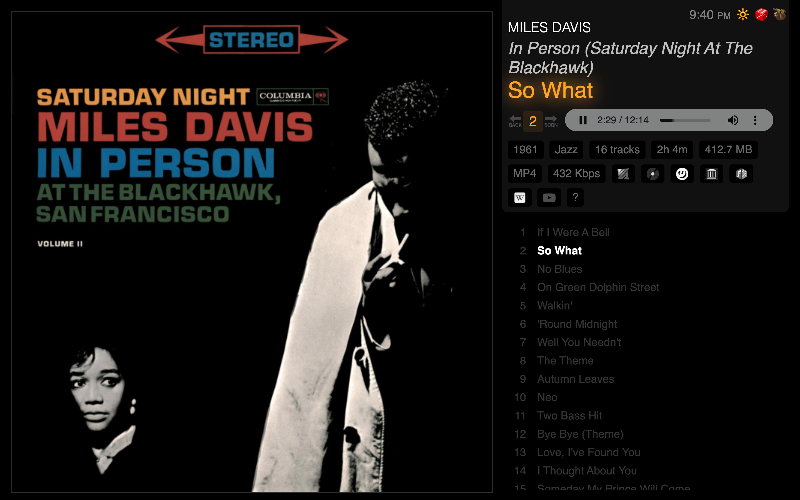

Moo
===

_An album-forward, read-only music player_


[](screenshot.png)


Choose your music folder:

```
Moo/play/config.py:

BASE ='/Users/steve/Music'
```

Clone the app:

```
$ git clone https://github.com/siznax/moo.git
```

Start the app:

```
$ cd moo
$ ./play.sh
# visit localhost:5000 in your browser
```

Progress
--------

```
- [x] Album-forward index, playback
- [x] Play random album or track
- [x] Show related albums, index, covers
- [x] Show help, keyboard shortcuts, etc.
- [ ] Add `jQuery` for AJAX
- [ ] Add `typeahead.js` on index
- [ ] Add `Bootstrap` for responsive
- [ ] Raise flag for DRM'd audio
```


@siznax
